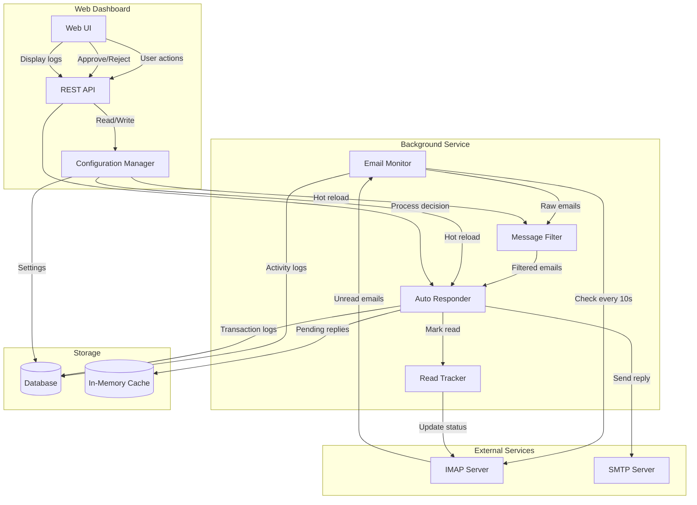

# Design Document

## Overview

LazyMailBOSS is an automated email response system built with a modular architecture that separates concerns between email monitoring, message filtering, response generation, and user interface. The system uses IMAP for email monitoring and SMTP for sending replies, with a web-based dashboard for configuration and monitoring.

The core design follows a pipeline architecture where emails flow through multiple stages: retrieval → filtering → response generation → (optional confirmation) → sending. This allows for flexible configuration and easy extension of filtering rules.

## Architecture

### High-Level Architecture



### Component Responsibilities

1. **Email Monitor**: Polls IMAP server, retrieves unread emails, coordinates processing pipeline
2. **Message Filter**: Applies keyword and domain filtering rules to determine eligibility
3. **Auto Responder**: Generates replies, handles confirmation workflow, sends via SMTP
4. **Read Tracker**: Manages email read status to prevent duplicates
5. **Web Dashboard**: Provides UI for configuration, monitoring, and manual confirmation
6. **Configuration Manager**: Handles settings persistence and hot-reloading

## Components and Interfaces

### Email Monitor

**Responsibilities:**
- Poll IMAP server every 10 seconds
- Retrieve unread email metadata and content
- Pass emails through the processing pipeline
- Handle connection errors with retry logic

**Interface:**
```typescript
interface EmailMonitor {
  start(): Promise<void>
  stop(): Promise<void>
  checkInbox(): Promise<Email[]>
  processEmail(email: Email): Promise<void>
}

interface Email {
  id: string
  from: string
  to: string
  subject: string
  body: string
  receivedAt: Date
  isRead: boolean
}
```

### Message Filter

**Responsibilities:**
- Evaluate emails against keyword rules
- Evaluate emails against domain exclusion rules
- Determine if email should receive auto-reply

**Interface:**
```typescript
interface MessageFilter {
  shouldAutoReply(email: Email): FilterDecision
  updateKeywords(keywords: string[]): void
  updateExcludedDomains(domains: string[]): void
}

interface FilterDecision {
  approved: boolean
  reason: string
  matchedKeywords?: string[]
}
```

### Auto Responder

**Responsibilities:**
- Generate appropriate reply messages
- Handle manual confirmation workflow
- Send replies via SMTP
- Log all transactions

**Interface:**
```typescript
interface AutoResponder {
  generateReply(email: Email): Reply
  sendReply(reply: Reply): Promise<SendResult>
  queueForConfirmation(reply: Reply): void
  processConfirmation(replyId: string, approved: boolean): Promise<void>
}

interface Reply {
  id: string
  originalEmailId: string
  to: string
  subject: string
  body: string
  generatedAt: Date
  status: 'pending' | 'approved' | 'rejected' | 'sent'
}

interface SendResult {
  success: boolean
  error?: string
  sentAt?: Date
}
```

### Read Tracker

**Responsibilities:**
- Mark emails as read in IMAP server
- Prevent duplicate processing

**Interface:**
```typescript
interface ReadTracker {
  markAsRead(emailId: string): Promise<void>
  isRead(emailId: string): Promise<boolean>
}
```

### Configuration Manager

**Responsibilities:**
- Persist configuration to database
- Provide hot-reload capability
- Validate configuration changes

**Interface:**
```typescript
interface ConfigurationManager {
  getConfig(): Promise<Config>
  updateConfig(updates: Partial<Config>): Promise<void>
  subscribe(listener: (config: Config) => void): void
}

interface Config {
  email: {
    imapHost: string
    imapPort: number
    smtpHost: string
    smtpPort: number
    username: string
    password: string
  }
  filters: {
    keywordsEnabled: boolean
    keywords: string[]
    excludedDomains: string[]
  }
  autoReply: {
    manualConfirmation: boolean
    replyTemplate: string
    checkInterval: number
  }
}
```

### Web Dashboard API

**Responsibilities:**
- Expose REST endpoints for configuration
- Provide activity logs
- Handle manual confirmation actions

**Interface:**
```typescript
interface DashboardAPI {
  // Status
  GET /api/status
  
  // Configuration
  GET /api/config
  PUT /api/config
  
  // Activity logs
  GET /api/logs?limit=100&offset=0
  
  // Manual confirmation
  GET /api/pending-replies
  POST /api/replies/:id/approve
  POST /api/replies/:id/reject
}
```

## Data Models

### Email

Represents an email message retrieved from the inbox.

```typescript
interface Email {
  id: string                 // Unique identifier from IMAP
  from: string              // Sender email address
  to: string                // Recipient email address
  subject: string           // Email subject line
  body: string              // Email body content
  receivedAt: Date          // When email was received
  isRead: boolean           // Read status
}
```

### Reply

Represents a generated auto-reply message.

```typescript
interface Reply {
  id: string                      // Unique identifier
  originalEmailId: string         // Reference to original email
  to: string                      // Recipient email address
  subject: string                 // Reply subject
  body: string                    // Reply body content
  generatedAt: Date              // When reply was generated
  status: ReplyStatus            // Current status
  sentAt?: Date                  // When reply was sent (if sent)
  approvedBy?: string            // User who approved (if manual)
}

type ReplyStatus = 'pending' | 'approved' | 'rejected' | 'sent' | 'failed'
```

### ActivityLog

Represents a logged transaction or event.

```typescript
interface ActivityLog {
  id: string
  timestamp: Date
  type: 'reply_sent' | 'reply_failed' | 'email_filtered' | 'error'
  emailId: string
  replyId?: string
  details: string
  metadata?: Record<string, any>
}
```

### Configuration

Represents system configuration.

```typescript
interface Config {
  email: EmailConfig
  filters: FilterConfig
  autoReply: AutoReplyConfig
}

interface EmailConfig {
  imapHost: string
  imapPort: number
  smtpHost: string
  smtpPort: number
  username: string
  password: string          // Encrypted at rest
}

interface FilterConfig {
  keywordsEnabled: boolean
  keywords: string[]
  excludedDomains: string[]
}

interface AutoReplyConfig {
  manualConfirmation: boolean
  replyTemplate: string
  checkInterval: number     // In seconds
}
```


## Correctness Properties

*A property is a characteristic or behavior that should hold true across all valid executions of a system—essentially, a formal statement about what the system should do. Properties serve as the bridge between human-readable specifications and machine-verifiable correctness guarantees.*

### Property 1: Monitoring interval consistency

*For any* monitoring session, the EmailMonitor should check the inbox at intervals of 10 seconds (±1 second tolerance for system delays).

**Validates: Requirements 1.1**

### Property 2: Email metadata completeness

*For any* unread email detected by the EmailMonitor, the retrieved Email object should contain non-empty values for id, from, to, subject, body, and receivedAt fields.

**Validates: Requirements 1.2**

### Property 3: Connection retry on failure

*For any* connection error encountered during inbox checking, the EmailMonitor should attempt to reconnect at the next scheduled interval.

**Validates: Requirements 1.3**

### Property 4: Reply generation for filtered emails

*For any* email that passes all filters (keyword and domain checks), the AutoResponder should generate a Reply object with valid to, subject, and body fields.

**Validates: Requirements 2.1**

### Property 5: Manual confirmation queuing

*For any* generated reply when manual confirmation mode is enabled, the reply status should be 'pending' and the reply should not be sent until explicitly approved.

**Validates: Requirements 2.2**

### Property 6: Email marked as read after processing

*For any* email that receives a generated reply (whether approved, rejected, or auto-sent), the email should be marked as read in the inbox regardless of the reply's final status.

**Validates: Requirements 2.3, 2.4**

### Property 7: Automatic sending in auto mode

*For any* generated reply when manual confirmation mode is disabled, the reply should be sent immediately and its status should transition to 'sent'.

**Validates: Requirements 2.5**

### Property 8: Transaction logging completeness

*For any* successfully sent reply, an ActivityLog entry should exist with type 'reply_sent', containing the emailId, replyId, timestamp, and recipient information.

**Validates: Requirements 2.6**

### Property 9: Error logging and continuation

*For any* failed reply send operation, an ActivityLog entry with type 'reply_failed' should be created, and the system should continue processing subsequent emails without interruption.

**Validates: Requirements 2.7**

### Property 10: Read status persistence

*For any* email marked as read by the ReadTracker, querying the IMAP server should return that email with isRead = true.

**Validates: Requirements 3.1, 3.4**

### Property 11: Unread email filtering

*For any* inbox state, the EmailMonitor should only retrieve emails where isRead = false.

**Validates: Requirements 3.2**

### Property 12: Keyword matching in subject and body

*For any* email and keyword list (when keyword filtering is enabled), the KeywordMatcher should search for keyword occurrences in both the subject and body fields.

**Validates: Requirements 4.1**

### Property 13: Keyword filter approval logic

*For any* email when keyword filtering is enabled, the MessageFilter should approve the email if and only if at least one configured keyword appears in the subject or body.

**Validates: Requirements 4.2, 4.3**

### Property 14: Keyword filter bypass

*For any* email when keyword filtering is disabled, the keyword check should pass (approve) regardless of email content.

**Validates: Requirements 4.4**

### Property 15: Domain extraction correctness

*For any* email address in the format "user@domain.com", the DomainFilter should extract "domain.com" as the sender domain.

**Validates: Requirements 5.1**

### Property 16: Domain exclusion logic

*For any* email, the DomainFilter should reject it if and only if the sender domain matches any domain in the excluded domains list.

**Validates: Requirements 5.2, 5.3**

### Property 17: Configuration hot-reload

*For any* configuration change (keywords, excluded domains, manual confirmation mode, reply template), the change should be applied to the respective components immediately without requiring a system restart, and the next processed email should use the updated configuration.

**Validates: Requirements 5.4, 6.3, 6.4, 6.7, 8.3**

### Property 18: Credential encryption at rest

*For any* email credentials saved through the WebDashboard, the password field should be encrypted in the database and never stored in plaintext.

**Validates: Requirements 6.2**

### Property 19: Activity log display completeness

*For any* activity log entry displayed in the WebDashboard, it should include timestamp, type, emailId, and details fields.

**Validates: Requirements 6.5**

### Property 20: Pending reply display

*For any* pending reply (status = 'pending') when manual confirmation is enabled, the WebDashboard should display it with both approve and reject action buttons.

**Validates: Requirements 6.6**

### Property 21: Continuous monitoring operation

*For any* running EmailMonitor instance, it should continue checking the inbox at regular intervals until explicitly stopped, even after encountering non-fatal errors.

**Validates: Requirements 7.2, 7.3**

### Property 22: Graceful shutdown

*For any* email being processed when the system receives a stop signal, the EmailMonitor should complete processing that email (including marking as read) before shutting down.

**Validates: Requirements 7.4**

### Property 23: Log persistence and accessibility

*For any* ActivityLog entry created by the system, it should be stored in the database and retrievable through the WebDashboard API.

**Validates: Requirements 8.4**

## Error Handling

### Connection Errors

**IMAP Connection Failures:**
- Retry on next scheduled interval (10 seconds)
- Log error with connection details
- Do not crash the monitoring loop
- After 5 consecutive failures, send alert notification

**SMTP Send Failures:**
- Log error with email details and error message
- Mark reply status as 'failed'
- Continue processing other emails
- Store failed reply for manual retry option

### Invalid Configuration

**Missing or Invalid Credentials:**
- Prevent system startup
- Display clear error message in dashboard
- Provide validation feedback in UI

**Invalid Email Addresses:**
- Skip malformed emails
- Log warning with email ID
- Continue processing other emails

### Data Validation Errors

**Malformed Email Content:**
- Use fallback values for missing fields
- Log warning with email ID
- Continue processing

**Template Rendering Errors:**
- Use default template
- Log error
- Continue processing

### Rate Limiting

**IMAP Rate Limits:**
- Implement exponential backoff
- Increase check interval temporarily
- Log rate limit events

**SMTP Rate Limits:**
- Queue replies for delayed sending
- Implement retry with backoff
- Log rate limit events

## Testing Strategy

### Unit Testing

Unit tests will verify specific examples and edge cases:

**Email Monitor:**
- Test inbox checking with mock IMAP responses
- Test error handling with simulated connection failures
- Test graceful shutdown during email processing

**Message Filter:**
- Test keyword matching with various email formats
- Test domain extraction from different email address formats
- Test filter combinations (keywords + domains)

**Auto Responder:**
- Test reply generation with different templates
- Test manual confirmation workflow state transitions
- Test SMTP sending with mock server

**Configuration Manager:**
- Test configuration validation
- Test hot-reload notification to subscribers
- Test credential encryption/decryption

### Property-Based Testing

Property-based tests will verify universal properties across all inputs using **fast-check** (for TypeScript/JavaScript). Each test will run a minimum of 100 iterations.

**Configuration:**
- Use fast-check library for TypeScript
- Configure 100 minimum iterations per property test
- Each property test must reference its design document property using the format: `**Feature: lazy-mail-boss, Property {number}: {property_text}**`

**Test Coverage:**
- Each correctness property listed above will have a corresponding property-based test
- Tests will generate random emails, configurations, and system states
- Tests will verify properties hold across all generated inputs

**Example Property Test Structure:**
```typescript
// **Feature: lazy-mail-boss, Property 13: Keyword filter approval logic**
fc.assert(
  fc.property(
    emailArbitrary,
    keywordListArbitrary,
    (email, keywords) => {
      const filter = new MessageFilter({ keywordsEnabled: true, keywords });
      const decision = filter.shouldAutoReply(email);
      const hasKeyword = keywords.some(kw => 
        email.subject.includes(kw) || email.body.includes(kw)
      );
      return decision.approved === hasKeyword;
    }
  ),
  { numRuns: 100 }
);
```

### Integration Testing

Integration tests will verify component interactions:

- Email Monitor → Message Filter → Auto Responder pipeline
- Configuration Manager → Component hot-reload
- Web Dashboard API → Backend services
- IMAP/SMTP integration with test email server

### End-to-End Testing

E2E tests will verify complete workflows:

- Full auto-reply workflow (unread email → filter → send → mark read)
- Manual confirmation workflow (generate → queue → approve → send)
- Configuration update workflow (dashboard → config → component reload)
- System restart and recovery

## Deployment Architecture

### Local Development

```
┌─────────────────┐
│  Node.js App    │
│  - Monitor      │
│  - API Server   │
│  - Web UI       │
└────────┬────────┘
         │
    ┌────┴────┐
    │ SQLite  │
    └─────────┘
```

### Cloud Deployment (Docker + Cloud Platform)

```
┌──────────────────────────────────┐
│         Load Balancer            │
└────────────┬─────────────────────┘
             │
    ┌────────┴────────┐
    │                 │
┌───▼────┐      ┌────▼────┐
│ Web UI │      │ API     │
│ (Nginx)│      │ Server  │
└────────┘      └────┬────┘
                     │
              ┌──────┴──────┐
              │             │
        ┌─────▼─────┐ ┌────▼─────┐
        │  Monitor  │ │ Database │
        │  Service  │ │ (Postgres)│
        └───────────┘ └──────────┘
```

**Cloud Platform Options:**
- AWS: ECS/Fargate for containers, RDS for database
- Google Cloud: Cloud Run for containers, Cloud SQL for database
- Heroku: Web dyno + worker dyno, Postgres add-on
- DigitalOcean: App Platform with managed database

**Container Strategy:**
- Separate containers for web UI, API server, and monitor service
- Shared database connection
- Environment-based configuration
- Health checks for auto-restart
- Log aggregation to cloud logging service

## Security Considerations

### Credential Storage

- Email passwords encrypted using AES-256
- Encryption key stored in environment variable
- Never log passwords or tokens
- Use OAuth2 when supported by email provider

### API Security

- JWT-based authentication for dashboard API
- Rate limiting on all endpoints
- CORS configuration for web UI
- Input validation and sanitization

### Email Content

- Sanitize email content before display
- Prevent XSS in dashboard
- Limit email body size to prevent DoS
- Validate email addresses before sending

## Performance Considerations

### Scalability

- Single instance handles ~100 emails per minute
- Database connection pooling
- In-memory cache for pending replies
- Async/await for non-blocking I/O

### Resource Usage

- Memory: ~100MB base + ~1KB per cached reply
- CPU: Minimal (mostly I/O bound)
- Network: Depends on email volume
- Database: ~1KB per log entry

### Optimization Strategies

- Batch mark-as-read operations
- Cache filter configuration
- Lazy load activity logs
- Implement pagination for large result sets
